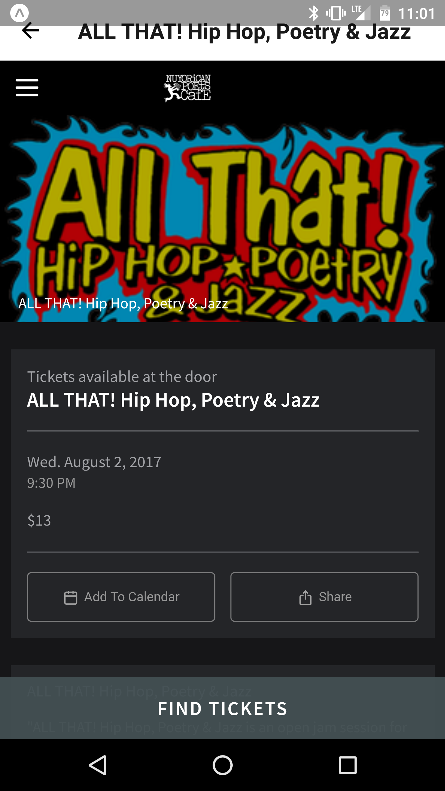

# Hip Hop Events

## Description
Hip Hop Events is a mobile app that let's users discover events happening at the Nuyorican Poet Cafe. The events are sourced from http://www.nuyorican.org/calendar/ a website which offers a limited user interaction on mobile phones. This App provides a simple way to view the events and purchase tickets on a mobile phone.

## Screenshots

## Getting Started

1. Install Genymotion
1. Install Expo
1. Install npm dependencies

## Development

1. Open Genymotion, start virtual device, make sure Settings -> Adb is pointed to local adb
1. cd hiphopevents-app && npm run android

## Publish to Expos

1. Open Expo
1. Open `Hip Hop Events` project
1. After building, click Publish

### Troubleshooting

1. Issue: `version: undefined` error inside Expo. Resolution: run npm install then rebuild
